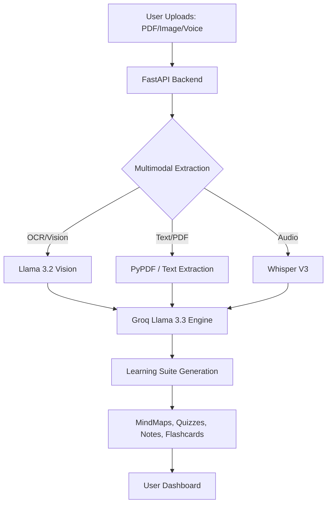

# 🧠 AutoLearn AI Studio
### *The Ultimate Multimodal AI Learning Ecosystem*

[](https://fastapi.tiangolo.com)
[](https://reactjs.org)
[](https://tailwindcss.com)
[](https://groq.com)

<br/>

[](https://autolearnai-frontend.onrender.com)
---

## 📖 Project Overview

**AutoLearn AI Studio** is a premium, production-grade multimodal learning platform designed to revolutionize how students and professionals consume educational content. By leveraging state-of-the-art AI models like **Llama 3.3 (70B)** and **Llama 3.2 Vision**, the platform transforms static PDFs, handwritten notes, images, and voice recordings into a comprehensive, interactive study suite.

Whether you're preparing for a high-stakes exam or deep-diving into academic research, AutoLearn AI Studio provides a centralized hub for personalized, adaptive, and multimodal learning.

---

## ✨ Core Features

*   **📚 Smart Notes Generation**: Automatically distills complex documents into structured, markdown-rendered study notes.
*   **🧠 Dynamic Mind Mapping**: Visualizes concepts using **ReactFlow**, allowing for non-linear exploration of topics.
*   **❓ Adaptive Quizzes**: Generates MCQs with real-time scoring, performance analytics, and detailed explanations.
*   **🗂️ 3D Flashcards**: High-fidelity digital flashcards for active recall and spaced repetition.
*   **📖 Technical Glossary**: Context-aware vocabulary extraction with formal academic definitions.
*   **💬 AI Socratic Tutor**: A document-aware chat interface that guides users through concepts using Socratic questioning.

---

## 🚀 Advanced AI Capabilities

*   **🎥 Virtual AI Professor**: Features a custom-animated AI avatar that provides high-level video lecture summaries of your study sessions.
*   **📄 Scan & Solve (Vision)**: Upload photos of handwritten math problems or broken code. The AI analyzes the image and provides a step-by-step interactive breakdown.
*   **🎙️ AI Podcast Studio**: Converts your study notes into a conversational "Talk Show" podcast with distinct, natural-sounding male and female AI voices.
*   **🔬 Research Hub**: Integrated search across **200M+ academic papers** (Semantic Scholar & arXiv) with instant AI-powered summarization.

---

## 📥 Multimodal Input System

AutoLearn AI Studio supports a truly versatile input pipeline, allowing users to mix and match sources for a unified study session:
*   **Multiple PDFs**: Batch upload complex textbooks or lecture slides.
*   **Images & OCR**: Support for JPG, PNG, and WebP (Handwritten notes, diagrams).
*   **Voice & Audio**: Upload MP3/WAV recordings of lectures for instant transcription and analysis.
*   **Mixed Input Support**: Combine a PDF textbook chapter with a photo of your handwritten classroom notes for a holistic summary.

---

## 🏆 Exam Mode Features

Push your limits with our specialized Exam Mode suite, designed to simulate real-world testing environments:
*   **Practice Mode**: No timers, instant feedback on every question.
*   **Timed Mode**: Simulate the pressure of real exams with countdown timers.
*   **Adaptive Mode**: AI adjusts question difficulty based on your previous answers.
*   **Topic-wise Tests**: Focus on specific knowledge gaps identified by the AI.
*   **Mock Tests**: Full-length simulations covering the entire scope of your uploaded material.

---

## 🔄 Workflow Diagram



---

## 🏗️ System Architecture

AutoLearn AI Studio is built on a high-concurrency, asynchronous architecture:
*   **Frontend**: Single Page Application (SPA) with reactive state management and global context.
*   **Backend**: Async FastAPI server handling non-blocking AI generation and multimodal processing.
*   **Database Layer**: MongoDB for persistence of sessions, history, and user-specific adaptive data.
*   **AI Orchestration**: Parallelized calls to multiple LLM providers and search APIs for minimal latency.

---

## 🛠️ Tech Stack

*   **Frontend**: React.js, Vite, TypeScript
*   **Styling**: Tailwind CSS, Shadcn/UI
*   **Animations**: Framer Motion
*   **Visualization**: ReactFlow
*   **Backend**: FastAPI (Python)
*   **Database**: MongoDB (Motor)
*   **AI Infrastructure**: Groq (Llama 3.3/3.2), Whisper-v3

---

## 🌐 API Integrations

The platform orchestrates 8+ external services to provide a seamless experience:
*   **Groq**: Core LLM & Vision reasoning.
*   **YouTube Data API**: Topic-aware video recommendations.
*   **Semantic Scholar & arXiv**: Academic paper sourcing.
*   **Pexels**: High-quality visual grounding imagery.
*   **Wikipedia**: Factual grounding and historical context.
*   **DuckDuckGo**: Real-time web-search for latest resources.
*   **Free Dictionary**: Phonetics and technical word definitions.

---

## ⚙️ Installation & Setup

### Prerequisites
*   Node.js 18+
*   Python 3.11+
*   MongoDB (Atlas or Local)

### 1. Clone the Repo
```bash
git clone https://github.com/Sakshichikhale1/AutoLearn-AI.git
cd AutoLearn-AI
```

### 2. Backend Installation
```bash
cd backend
python -m venv venv
source venv/bin/activate  # On Windows: venv\Scripts\activate
pip install -r requirements.txt
```

### 3. Frontend Installation
```bash
cd ../frontend
npm install
```

---

## 🔑 Environment Variables

Create a `.env` file in the `backend/` directory:

```env
GROQ_API_KEY=your_groq_api_key
MONGODB_URL=your_mongodb_connection_string
YOUTUBE_API_KEY=your_youtube_api_key
JWT_SECRET=your_secure_jwt_secret

# Optional Integrations
PEXELS_API_KEY=your_pexels_key
HUGGINGFACE_API_KEY=your_hf_key
```

---

## 🚀 Running the Platform

### Start Backend
```bash
cd backend
uvicorn main:app --reload
```

### Start Frontend
```bash
cd frontend
npm run dev
```

The app will be available at `http://localhost:5173`.

---

## 💡 Usage Flow

1.  **Upload**: Select multiple files or paste a YouTube link.
2.  **Generate**: Wait 5-10 seconds for the AI to synthesize your personal study suite.
3.  **Engage**: Listen to the podcast, watch the Virtual Professor, or explore the Mind Map.
4.  **Practice**: Take adaptive quizzes and review flashcards.
5.  **Research**: Use the Research Hub to find cited papers for deep study.

---

## 🎯 Use Cases

*   **🎓 University Students**: Summarizing 50-page research papers and creating mock exams.
*   **💻 Developers**: Explaining complex codebases or technical documentation via "Scan & Solve."
*   **🏢 Corporate Trainers**: Converting training manuals into interactive internal learning portals.
*   **🏫 Educators**: Generating high-quality classroom materials and quizzes instantly.

---

## 🔮 Future Enhancements

- [ ] **Collaborative Study Rooms**: Real-time shared mind maps and group quizzes.
- [ ] **ElevenLabs Integration**: For ultra-realistic, emotive AI Professor voices.
- [ ] **Mobile App (React Native)**: Native mobile experience with offline study mode.
- [ ] **LMS Integration**: Seamless export to Canvas, Moodle, and Google Classroom.


